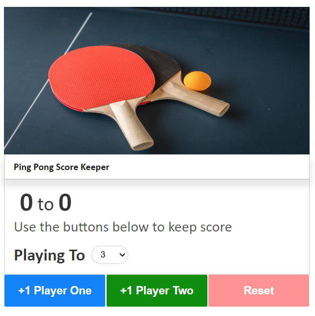

# Score Keeper

Tracks a ping-pong match score that have a way to score eleven points.

It was training mostly to Javascript and DOM manipulation explored on the console and passed to script.

## Preview Picture

### See in action

If you want to see how it works, I recommend [forking](https://docs.github.com/en/get-started/quickstart/fork-a-repo) this repo and opening it in an IDE, in a Source-code editor, or browser.

## Technologies

## Author

Hugo Teixeira - 8Dev - Djbetamax

### Contact links

